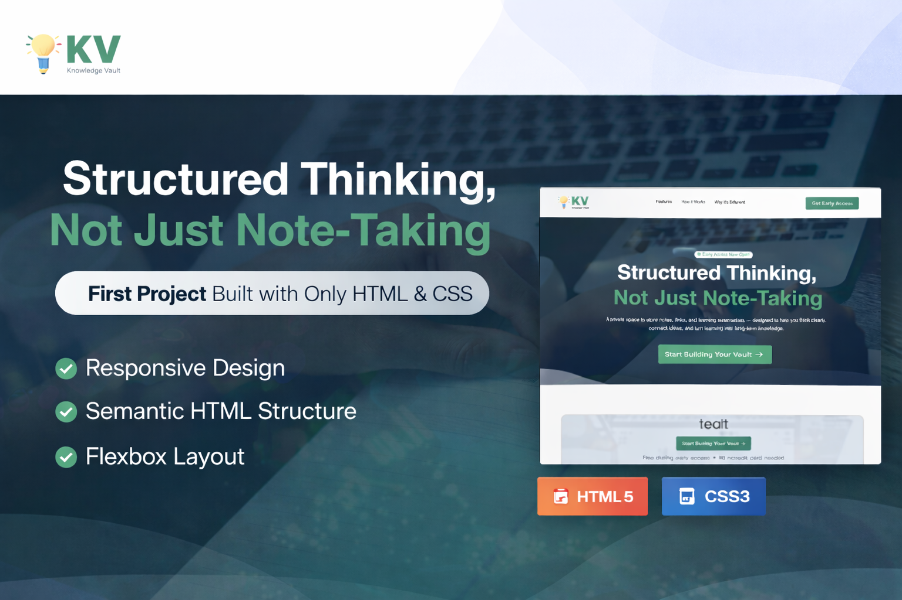

  

<h1 align="center">💡 Knowledge Vault</h1>

---

## 📌 Project Overview

**Knowledge Vault** is a clean, structured landing page concept designed to present a "Personal Knowledge Management" system.

It introduces the idea of building a structured second brain — focusing on clarity, organization, and long-term knowledge retention.

This project emphasizes:

- Structured layout design
- Visual hierarchy
- Section-based content organization
- Landing page UI composition
- Professional product presentation

---

## 🔗 Live Demo

👉 https://rzoshin.github.io/knowledge-vault/

---

## ✨ Key Sections

- Hero Section with call-to-action
- Problem Statement Cards
- Solution Overview
- Feature Highlights
- Conversion Call-to-Action Section
- Structured Footer

---

## 🛠 Technologies Used

- **HTML5**
- **CSS3**
- Flexbox Layout
- Responsive Design Principles
- Custom UI Styling

---

## 🎯 Why This Project Matters

This was my **first project built entirely using only HTML and CSS**.

It helped me:

- Understand semantic HTML structure
- Practice layout systems (Flexbox)
- Build responsive design without frameworks
- Improve spacing, typography, and visual balance
- Develop a strong foundation in front-end fundamentals

Before JavaScript.  
Before frameworks.  
Just structure and styling — done properly.

---

## 🚀 Future Improvements

- Add JavaScript interactivity
- Form handling functionality
- Animation enhancements
- Dark/Light mode toggle
- Backend integration

---

## 👨‍💻 Author

**Raiyan Zannat**  
CSE Graduate | MSc Engineering Candidate |
Building structured systems, one project at a time